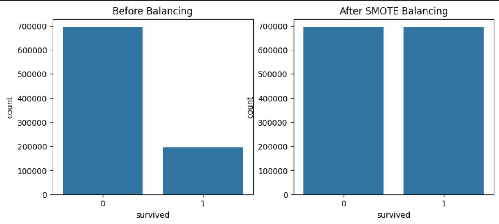
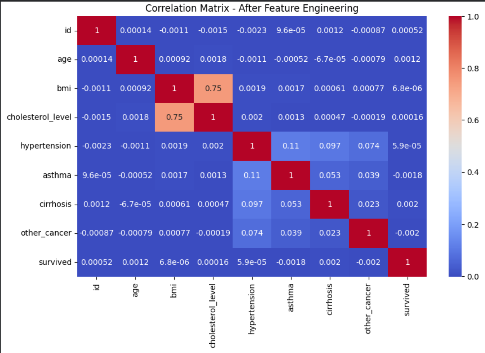
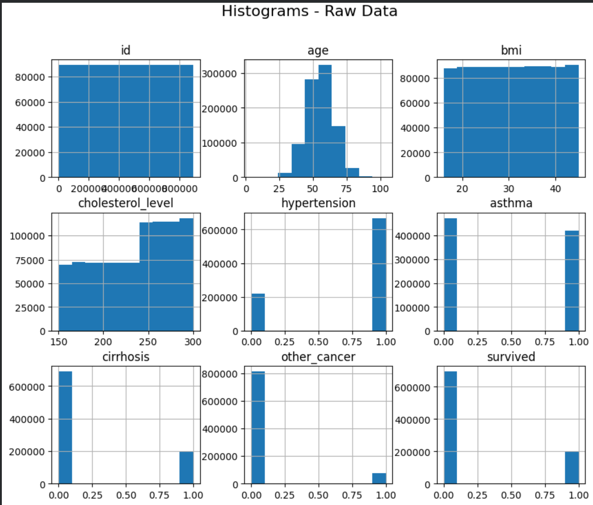

# Cancer Survival Prediction

Machine Learning project for predicting cancer patient survival using demographic, clinical, and lifestyle-related features.

---

## Overview

This project applies machine learning techniques to predict cancer patient survival using a large-scale dataset containing approximately 890,000 records and 17 features.

The project covers the complete machine learning pipeline, including exploratory data analysis (EDA), data preprocessing, class balancing, model training, hyperparameter tuning, and performance evaluation.

A major challenge in the dataset was class imbalance, with only around 22% of records belonging to the survival class. SMOTE (Synthetic Minority Oversampling Technique) was used to address this issue.

---

## Dataset

* Source: Kaggle
* Records: ~890,000
* Features: 17
* Target Variable: `survived`
* Problem Type: Binary Classification

| Value | Class           |
| ----- | --------------- |
| 0     | Did Not Survive |
| 1     | Survived        |

---

## Project Workflow

### Exploratory Data Analysis (EDA)

* Feature distribution analysis
* Correlation analysis
* Class imbalance analysis
* Outlier detection

### Data Preprocessing

* Missing value handling
* Outlier removal
* Feature engineering
* Feature scaling using StandardScaler
* Categorical feature encoding using OneHotEncoder

### Class Balancing

* SMOTE (Synthetic Minority Oversampling Technique)

### Model Development

The following classification models were trained and evaluated:

* Logistic Regression
* Random Forest Classifier
* XGBoost Classifier

### Hyperparameter Optimization

* GridSearchCV

### Evaluation Metrics

* Accuracy
* Precision
* Recall
* F1-Score
* ROC-AUC Score
* Confusion Matrix

---

## Visualizations

### Class Distribution Before and After SMOTE



### Correlation Heatmap



### Feature Distribution Analysis



---

## Technologies Used

* Python
* Pandas
* NumPy
* Matplotlib
* Seaborn
* Scikit-learn
* Imbalanced-learn (SMOTE)
* XGBoost
* Google Colab

---

## Repository Structure

```text
cancer-survival-prediction/
│
├── notebooks/
│   └── cancer_survival_prediction.ipynb
│
├── screenshots/
│   ├── class_distribution_smote.png
│   ├── correlation_heatmap.png
│   └── raw_data_histograms.png
│
└── README.md
```

---

## Future Enhancements

* Advanced feature selection techniques
* Explainable AI (SHAP/LIME)
* Additional ensemble learning approaches
* Model deployment using Flask or Streamlit

---

## Academic Information

Developed as part of a university Machine Learning group project consisting of six team members.

---

## License

This project is provided for educational and portfolio purposes.
